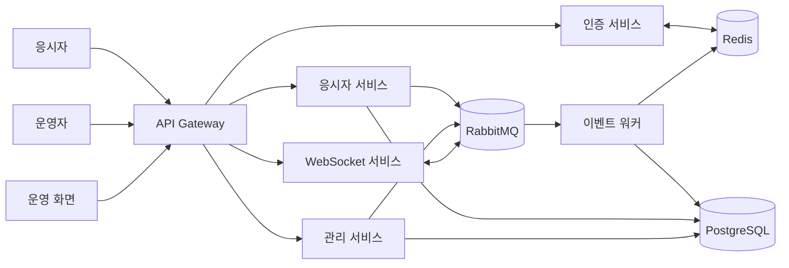

# 실시간 온라인 평가 운영 플랫폼

온라인 평가가 진행되는 동안 응시자 상태, 답안, 접속 기록, 실시간 메시지를 처리하고 운영자가 전체 상황을 확인할 수 있도록 구성한 마이크로서비스 기반 플랫폼입니다.

백엔드 개발자로 참여하였습니다. 공통 도메인 모델부터 응시자 API, 인증, Gateway, 메시지 워커까지 서비스 간 데이터 흐름을 연결하는 작업을 주로 맡았습니다.

## 원본 기반 구현 사례

입력 조건과 처리 순서를 구체적으로 확인할 수 있도록 공개 예제를 확장하였습니다. 각 사례에는 원본 근거, 재작성 범위와 테스트를 연결하였습니다.

| 구현 사례 | 공개 코드 |
|---|---|
| 시험 설정 JSON의 이중 직렬화 처리 | [SettingsListReader](samples/event-worker/src/main/java/com/portfolio/assessment/eventworker/cases/SettingsListReader.java) |
| 중첩 답안 요청에서 현재·이전 문항 분리 | [AnswerEnvelopeReader](samples/event-worker/src/main/java/com/portfolio/assessment/eventworker/cases/AnswerEnvelopeReader.java) |
| 캐시 반영 시도 후 영속 저장 순서 구성 | [CacheThenDatabase](samples/event-worker/src/main/java/com/portfolio/assessment/eventworker/cases/CacheThenDatabase.java) |
| 최신 활동 로그의 개수 제한과 만료 처리 | [RecentLogWriter](samples/event-worker/src/main/java/com/portfolio/assessment/eventworker/cases/RecentLogWriter.java) |

[사례별 처리 과정·입출력·테스트](docs/CASE-STUDIES.md) · [원본과 공개 예제의 차이](docs/SOURCE-SCOPE.md) · [검증 결과](docs/VALIDATION.md)

## 프로젝트에서 해결한 문제

온라인 평가는 짧은 시간에 상태 변경이 반복적으로 발생합니다. 답안 저장과 접속 기록처럼 반드시 남아야 하는 데이터가 있는 반면, 현재 접속 상태처럼 빠르게 조회해야 하는 정보도 있습니다.

이 두 성격을 한 서비스와 한 저장소에서 처리하면 요청이 몰릴 때 지연이 커지고, 한 기능의 장애가 다른 기능으로 번지기 쉽습니다. 이를 줄이기 위해 기능을 서비스 단위로 나누고, 실시간 상태와 영속 데이터를 분리하였습니다.

## 전체 구조

## 담당한 작업

### 공통 도메인과 데이터 접근 계층

시험계획, 세션, 응시자, 답안, 진행 상태 등 여러 서비스가 함께 사용하는 모델과 Repository를 공통 모듈로 관리하였습니다. 필드와 조회 조건이 바뀔 때 사용하는 서비스까지 함께 확인하고 버전을 올려 배포하였습니다.

### 응시자 기능

토큰에 포함된 시험 정보를 기준으로 응시 데이터를 조회하고, 답안·진행 상태·접속 로그·채팅·카메라 데이터를 처리하는 API를 구현하였습니다. 메시지 큐를 사용할 수 없는 상황에서는 필요한 데이터가 유실되지 않도록 저장 경로를 분기하였습니다.

### 인증과 Gateway

JWT 발급과 검증, Refresh Token, Redis 기반 토큰 상태 확인을 구현하였습니다. Gateway에서는 인증 필터와 서비스 라우팅을 구성하고, UI/API 경로 및 SSE 요청이 정상적으로 통과하도록 CORS 설정을 정리하였습니다.

### 이벤트 워커

RabbitMQ에서 답안, 상태, 로그, 채팅 이벤트를 받아 Redis와 PostgreSQL에 반영하는 워커를 구현하였습니다. 이벤트 종류별 저장 처리를 연결하고 Redis 반영 시도 후 DB 저장을 실행하도록 순서를 조정하였습니다.

### 관리 기능

외부 시험 데이터를 파일과 JSON 형태로 받아 저장하는 기능, 시험 데이터 동기화, Redis 업로드·삭제, 답안 파일 다운로드 기능을 구현하였습니다.

## 기술 선택

| 구분 | 사용 기술 | 적용 이유 |
|---|---|---|
| Backend | Java 17, Spring Boot, WebFlux | 여러 I/O 작업을 비동기 흐름으로 처리 |
| Gateway | Spring Cloud Gateway | 인증과 서비스 라우팅을 진입점에서 통합 |
| Messaging | RabbitMQ, Reactor RabbitMQ | 요청 처리와 저장 작업을 분리 |
| Cache | Redis | 접속 상태와 실시간 조회 데이터 관리 |
| Database | PostgreSQL, R2DBC | 답안과 로그 등 영속 데이터 저장 |
| Realtime | WebSocket, SSE | 응시자·감독관 메시지와 상태 전달 |
| Frontend | React, TypeScript, Vite | 운영 화면과 시험 상태 조회 |
| Build | Gradle, Docker | 서비스별 빌드와 실행 환경 구성 |

## 작업하면서 중요하게 본 부분

- Redis와 PostgreSQL에 같은 데이터를 무조건 중복 저장하지 않고 조회 목적에 따라 책임을 구분하였습니다.
- 요청 시점에 모든 저장을 끝내지 않고 메시지 큐와 워커로 넘겨 응시 API의 부담을 줄였습니다.
- 공통 모듈 변경이 여러 서비스에 영향을 주기 때문에 모델 변경과 버전 업데이트를 함께 관리하였습니다.
- 인증 로직을 각 서비스에 반복하지 않도록 Gateway와 인증 서비스의 역할을 나눴습니다.
- 운영 데이터가 누락되지 않도록 메시지 발행 실패와 저장 실패 흐름을 별도로 확인하였습니다.

서비스별 역할과 본인 구현은 [MSA별 담당 기능](docs/SERVICES.md), 기능과 공개 코드의 연결은 [기능별 구현 근거](docs/FEATURE-MATRIX.md), 처리 흐름은 [구현 상세](docs/IMPLEMENTATION.md)에 정리하였습니다. 부하 시험의 기준과 공개 시나리오는 [실시간 평가 부하 시험 설계](docs/PERFORMANCE-TEST.md)에서 확인할 수 있습니다.

## 기존 공개 예제

아래 예제의 이벤트 ID 멱등성·재시도 큐·보안 검증 규칙에는 공개용 추가 설계가 포함됩니다. 실제 담당 변경은 [근거 문서](docs/SOURCE-SCOPE.md)에 구분하였습니다.

- [이벤트 워커 샘플](samples/event-worker): 중복 이벤트 방지, 상태 저장, 영속화 실패 시 재시도 흐름을 Java 17과 Spring WebFlux로 재구성하였습니다.
- [인증·Gateway 샘플](samples/event-worker/src/main/java/com/portfolio/assessment/eventworker/auth): 토큰 만료, 활성 세션, 공개 경로와 보호 경로 검증을 재구성하였습니다.
- [응시자 답안 처리 샘플](samples/event-worker/src/main/java/com/portfolio/assessment/eventworker/examinee): 이벤트 발행과 큐 장애 시 대체 저장을 재구성하였습니다.
- [응시자 실시간 상태 샘플](samples/event-worker/src/main/java/com/portfolio/assessment/eventworker/examinee/MonitoringEventService.java): 카메라·채팅·이상행위 이벤트의 문맥 검증, 중복 방지와 대체 저장을 재구성하였습니다.
- [관리자 시험자료 반입 샘플](samples/event-worker/src/main/java/com/portfolio/assessment/eventworker/manager): ZIP 항목과 필수 JSON 검증 후 일괄 저장을 재구성하였습니다.
- [관리 UI 상태관리 샘플](samples/manager-ui): 검색·페이지 상태와 Redis 작업 후 상세 재조회를 재구성하였습니다.

실시간 상태 저장 책임은 [응시자 실시간 상태 처리](docs/EXAMINEE-MONITORING.md)에 별도로 정리하였습니다.

회사 소스와 운영 데이터는 포함하지 않았습니다. 샘플 코드는 프로젝트에서 다뤘던 기술적 문제를 설명하기 위해 별도로 작성하였습니다.
