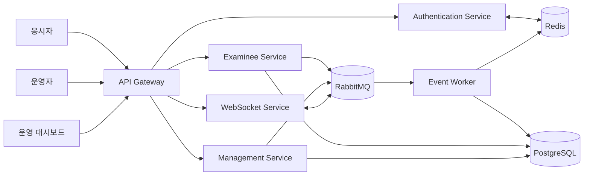

# Real-Time Online Assessment Platform

대규모 온라인 평가 과정에서 인증, 응시 진행, 실시간 통신, 이벤트 처리와 운영 모니터링을 분리한 마이크로서비스 기반 플랫폼 사례입니다.

> 이 저장소는 포트폴리오용 아키텍처 사례입니다. 실제 회사 코드, 고객 데이터, 내부 주소와 운영 설정은 포함하지 않습니다.

## 해결하려는 문제

- 응시자·감독관·운영자 요청을 역할별 서비스로 분리
- 답안, 상태, 로그와 실시간 메시지를 안정적으로 비동기 처리
- JWT와 Redis를 이용해 분산 환경의 인증 상태를 일관되게 관리
- 실시간 상태는 Redis, 영속 데이터는 PostgreSQL로 책임 분리
- API Gateway에서 인증 필터와 서비스 라우팅을 중앙화

## 아키텍처

## 서비스 책임

| 구성요소 | 책임 |
|---|---|
| API Gateway | JWT 검증, 예외 경로 관리, 서비스 라우팅, SSE/CORS 처리 |
| Authentication Service | 로그인, 액세스·리프레시 토큰 발급, Redis 기반 토큰 상태 관리 |
| Examinee Service | 응시 정보 조회, 답안·진행 상태·접속 로그 처리, 파일 및 카메라 데이터 수집 |
| Management Service | 시험 데이터 연계, 파일·JSON 처리, 운영 상태와 결과 관리 |
| WebSocket Service | 역할·그룹 단위 실시간 메시지 전달과 연결 상태 관리 |
| Event Worker | RabbitMQ 메시지 소비, Redis 실시간 상태 갱신, PostgreSQL 영속화 |
| Shared Domain Library | 공통 도메인 모델, 반응형 저장소 인터페이스와 공통 규약 제공 |
| Operations Dashboard | 시험 진행, 참가자 상태, 인프라와 이벤트 모니터링 |

## 담당 영역

본인이 확인한 Git 작성자 계정을 기준으로 로컬 이력을 분석해 정리했습니다. 실제 계정명과 회사 이메일은 공개 문서에서 제외합니다.

- 공통 도메인 모델과 반응형 저장소 설계
- 응시자 인증, 시험 데이터 조회, 답안·상태·로그 처리 API
- RabbitMQ 이벤트 발행과 장애 시 영속 저장 흐름
- Redis 기반 메시지·상태 처리 워커
- JWT 인증 서비스와 Redis 토큰 검증
- Gateway 라우팅, 인증 필터, SSE/CORS 설정
- 운영자용 시험 데이터 연계 및 파일 처리
- 운영 화면의 시험 조회와 Redis 동기화 기능

자세한 근거는 [기여 내역](docs/CONTRIBUTIONS.md)을 참고하세요.

## 기술 스택

| 영역 | 기술 |
|---|---|
| Backend | Java 17, Spring Boot, Spring WebFlux |
| Gateway | Spring Cloud Gateway |
| Data | PostgreSQL, Spring Data R2DBC |
| Cache | Redis |
| Messaging | RabbitMQ, Reactor RabbitMQ |
| Realtime | WebSocket, SSE |
| Frontend | React, TypeScript, Vite |
| Infrastructure | Docker, Docker Compose |
| Testing | JUnit, Gradle, JaCoCo |

## 주요 설계 포인트

### 실시간 처리와 영속 저장 분리

요청 처리 경로에서 모든 데이터를 직접 저장하지 않고 이벤트를 발행합니다. Worker가 메시지를 소비해 Redis의 실시간 상태와 PostgreSQL의 영속 데이터를 목적에 맞게 갱신합니다.

### 인증 상태 중앙화

Gateway와 인증 서비스가 JWT를 검증하고, Redis에 저장된 토큰 상태를 함께 확인합니다. 토큰 폐기와 세션 상태 변경을 여러 서비스에서 일관되게 반영할 수 있도록 구성했습니다.

### 공통 모델의 라이브러리화

여러 서비스에서 사용하는 시험, 사용자, 세션, 답안과 진행 상태 모델을 공통 라이브러리로 분리했습니다. 서비스 간 데이터 규약을 맞추고 중복 구현을 줄이는 것이 목적입니다.

## Code samples

- [Event worker sample](samples/event-worker): Java 17 / Spring WebFlux 기반의 독립 이벤트 처리 샘플

## 공개 범위

현재 초안은 아키텍처와 기여 설명만 공개 대상으로 봅니다. 실제 코드 공개가 필요하면 회사 코드의 복사본이 아니라 동일한 설계 문제를 독립적으로 구현한 샘플을 별도 작성합니다.

공개 전 확인 항목은 [공개 체크리스트](docs/PUBLICATION-CHECKLIST.md)를 참고하세요.
