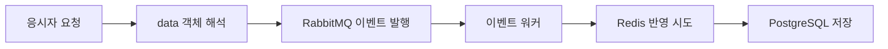

# IGTC Spring Boot 전환

기존 Java 시스템을 Spring Boot 기반 실시간 평가 구조로 전환하는 작업에 참여하였습니다. 공통 모델, 응시자 API, 인증·Gateway, 이벤트 워커, 관리자 반입 기능과 일부 운영 화면을 개발·수정하였습니다.

## 적용 구조

Java 17·Spring Boot 3 계열을 사용하고 서비스별로 빌드 구성을 분리하였습니다. 응시자 요청은 WebFlux로 처리하고, Redis와 PostgreSQL 접근에는 반응형 데이터 접근 구성을 사용하였습니다.

| 영역 | 담당 구현 |
|---|---|
| 공통 모듈 | 시험·세션·응시자·답안 모델과 Repository, 서비스 의존성 버전 관리 |
| 인증·Gateway | 토큰 발급·Redis 세션 확인, 인증 필터와 서비스 라우팅 |
| 응시자 API | 설정 조회, 답안 저장, 진행 상태·접속 로그·채팅 요청 |
| 이벤트 워커 | 메시지 소비, Redis 상태 반영과 PostgreSQL 저장 |
| 관리 서비스 | 시험계획·시험지·응시자 파일 반입과 데이터 동기화 |

## 답안 요청과 저장 처리

답안 요청 구조가 변경되면서 현재 문항과 진행 상태를 내부 data 객체에서 읽도록 수정하였습니다. 워커는 답안·시험 요약의 캐시 작업을 묶고 DB 저장으로 연결하도록 실행 순서를 조정하였습니다. 공통 모델 변경 시 해당 모델을 사용하는 서비스의 의존성도 함께 갱신하였습니다.

[답안 요청 예제](../samples/event-worker/src/main/java/com/portfolio/assessment/eventworker/cases/AnswerEnvelopeReader.java) · [저장 순서 예제](../samples/event-worker/src/main/java/com/portfolio/assessment/eventworker/cases/CacheThenDatabase.java)

## 담당 서비스

공통 모듈·응시자·관리·인증·워커·Gateway와 일부 관리 UI를 담당하였습니다. WebSocket 서비스에서는 공통 라이브러리 버전과 환경 설정을 수정하였습니다.

[서비스별 담당 기능](SERVICES.md) · [구현 상세](CASE-STUDIES.md)
