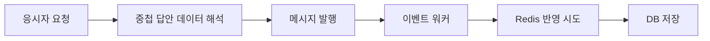

# IGTC Spring Boot 전환

기존 Java 시스템을 Spring Boot 기반 실시간 평가 구조로 전환하는 작업에 참여하였습니다. 공통 모델, 응시자 API, 인증·Gateway, 이벤트 워커, 관리자 반입과 일부 운영 화면을 개발·수정하였습니다.

전환 프로젝트와 현재 실시간 평가 원본의 대응 관계는 본인 확인을 받았습니다. 전환 후 원본의 빌드 설정에서 Java 17·Spring Boot 3 계열, WebFlux, 반응형 Redis·R2DBC 구성과 서비스별 분리를 확인하였습니다. 전환 전 전체 소스와의 일대일 이관표는 확보하지 못했으므로 모든 기능을 혼자 전환하였다고 표현하지 않았습니다.

## 전환 과정에서 담당한 구조

| 영역 | 구현 내용 | 상세 |
|---|---|---|
| 공통 데이터 | 시험·세션·응시자·답안 모델과 Repository를 공통 모듈에서 관리하고 서비스 의존성을 갱신하였습니다. | [공통 모듈](services/common.md) |
| 인증과 요청 전달 | 토큰 발급·Redis 세션 확인, Gateway 필터와 서비스 라우팅을 구성하였습니다. | [인증](services/security.md) · [Gateway](services/gateway.md) |
| 응시자 API | 설정 조회, 답안 저장, 진행 상태·접속 로그·채팅 요청을 구현·수정하였습니다. | [응시자 서비스](services/examinee.md) |
| 비동기 저장 | 메시지 소비 후 Redis 상태와 PostgreSQL 데이터를 반영하는 워커를 개발하였습니다. | [워커](services/worker.md) |
| 관리 데이터 반입 | 시험계획·시험지·응시자 파일을 읽어 관리 데이터와 연결하였습니다. | [관리 서비스](services/manager.md) |

## 답안 저장 경로의 구현 예

요청 데이터 구조가 변경된 부분에서는 내부 답안 묶음에서 현재 문항과 진행 상태를 읽도록 수정하였습니다. 워커에서는 여러 캐시 반영 작업을 묶은 뒤 DB 저장으로 연결하도록 실행 순서를 조정하였습니다. 서비스가 공유하는 데이터 모델 변경과 요청·저장 경로의 변경을 함께 다룬 사례입니다.

[요청 해석 예제](../samples/event-worker/src/main/java/com/portfolio/assessment/eventworker/cases/AnswerEnvelopeReader.java) · [저장 순서 예제](../samples/event-worker/src/main/java/com/portfolio/assessment/eventworker/cases/CacheThenDatabase.java) · [입출력·테스트](CASE-STUDIES.md)

## 기여와 검증 범위

담당 범위는 [Git 이력 기반 기여 정리](CONTRIBUTIONS.md)를 따릅니다. monitor·proctor 기능 개발은 본인 기여로 포함하지 않았고, websocket은 설정·공통 의존성 변경으로 한정하였습니다. 분산 트랜잭션, 무중단 전환, 장애 없는 메시지 전달과 정량 성능 향상은 확인 근거가 없어 성과로 추가하지 않았습니다.

공개 코드 검증은 [단위 예제 테스트](VALIDATION.md)입니다. 실제 전환 전체의 인수시험 결과와 구분하였습니다.
