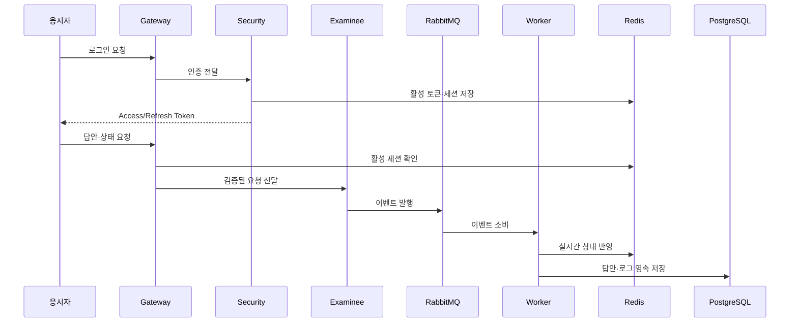

# 서비스별 담당 기능

공통 모듈·응시자·관리·인증·워커·Gateway와 일부 운영 UI를 개발·수정하였습니다. WebSocket 서비스에서는 라이브러리 버전과 환경 설정을 정리하였습니다.

| 서비스 | 담당 업무 | 상세 |
|---|---|---|
| common | 공통 도메인 모델과 반응형 Repository | [공통 모듈](services/common.md) |
| examinee | 응시자 API와 시험 진행 데이터 처리 | [응시자 서비스](services/examinee.md) |
| manager | 시험 데이터 반입·동기화·운영 관리 | [관리 서비스](services/manager.md) |
| manager-front | 시험 목록·상세·Redis 작업 UI | [관리 UI](services/manager-front.md) |
| security | JWT, Refresh Token, 세션과 로그인 | [인증 서비스](services/security.md) |
| worker | RabbitMQ 이벤트 소비와 Redis·DB 저장 | [이벤트 워커](services/worker.md) |
| gateway | 인증 필터와 서비스 라우팅 | [API Gateway](services/gateway.md) |
| websocket | 실시간 메시지 서비스 설정·공통 버전 정리 | [WebSocket 서비스](services/websocket.md) |

## 서비스 간 데이터 흐름

## 연계 서비스

[모니터링](services/monitor.md)과 [감독관 서비스](services/proctor.md)는 플랫폼의 연계 구성요소입니다.
