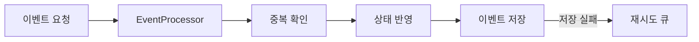

# Event Worker Sample

온라인 평가 중 발생하는 상태 변경 이벤트를 처리하는 흐름을 작은 Spring WebFlux 애플리케이션으로 정리했습니다.

실제 프로젝트에서는 RabbitMQ, Redis, PostgreSQL을 사용했지만 이 샘플은 별도 인프라 없이 실행할 수 있도록 메모리 구현체를 제공합니다. 각 저장소는 인터페이스로 분리했기 때문에 실제 어댑터로 교체할 수 있습니다.

## 처리 흐름



`EventProcessor`의 처리 순서는 다음과 같습니다.

1. 이벤트 ID를 기준으로 이미 처리한 이벤트인지 확인합니다.
2. 참가자의 현재 상태를 갱신합니다.
3. 이벤트를 영속 저장소에 기록합니다.
4. 저장에 실패하면 재시도 큐에 넣고 결과를 반환합니다.

## 코드 구조

```text
src/main/java/com/portfolio/assessment/eventworker
├── api       HTTP 요청과 응답
├── domain    이벤트 모델과 타입
├── service   이벤트 처리 순서
├── port      외부 저장소 인터페이스
└── adapter   실행용 메모리 구현체
```

## 실행 방법

Java 17과 Maven이 필요합니다.

```bash
mvn spring-boot:run
```

이벤트를 전송합니다.

```bash
curl -X POST http://localhost:8080/api/events \
  -H 'Content-Type: application/json' \
  -d '{
    "participantId": "participant-101",
    "type": "ANSWER_SAVED",
    "payload": {
      "questionId": "question-7",
      "answer": "A"
    }
  }'
```

처리된 상태를 조회합니다.

```bash
curl http://localhost:8080/api/participants/participant-101/state
```

## 테스트

```bash
mvn test
```

테스트에서는 정상 이벤트 처리, 동일 이벤트 재전송, 저장 실패 시 재시도 큐 전환을 확인합니다.

이 코드는 포트폴리오를 위해 새로 작성했으며 회사 소스나 운영 설정을 포함하지 않습니다.
