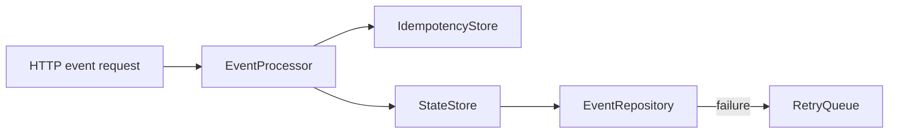

# Event Worker Sample

독립적으로 작성한 Java 17 / Spring WebFlux 샘플입니다. 온라인 평가 시스템에서 발생할 수 있는 상태 변경 이벤트를 처리하는 흐름을 단순화했습니다.

## 보여주는 설계

- 이벤트 ID 기반 중복 처리 방지
- 실시간 상태 저장소와 영속 저장소의 책임 분리
- 영속 저장 실패 시 재시도 큐로 위임
- 외부 인프라를 포트 인터페이스로 분리해 테스트 가능하게 구성

기본 구현은 실행 편의를 위해 메모리 저장소를 사용합니다. 실제 환경에서는 `StateStore`, `EventRepository`, `RetryQueue`, `IdempotencyStore` 포트를 Redis, PostgreSQL, RabbitMQ 등의 어댑터로 교체할 수 있습니다.

## 실행

```bash
mvn spring-boot:run
```

```bash
curl -X POST http://localhost:8080/api/events \
  -H 'Content-Type: application/json' \
  -d '{
    "participantId": "participant-101",
    "type": "ANSWER_SAVED",
    "payload": {"questionId": "question-7", "answer": "A"}
  }'
```

처리 후 상태는 다음과 같이 조회할 수 있습니다.

```bash
curl http://localhost:8080/api/participants/participant-101/state
```

## 처리 흐름



이 샘플은 회사 프로젝트 소스에서 복사한 코드가 아닙니다. 포트폴리오용으로 독립 작성했습니다.
